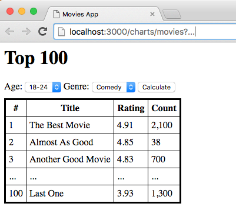

# Movies App

## Task 1: Top 100

You will work with the [MovieLens Dataset (ml-1m)](http://grouplens.org/datasets/movielens/) that has 4k movies, 6k users and 1m ratings. To save you some time we prepared a MySQL and Postgres dump for you to get you started. Pick the RDBS you are most comfortable with.

Take some time to understand the data. At the end of this document we have attached the description from the official README for this dataset.

Your task is to build a movie app (website) with a charts page that displays the top 100 movies from the database. The chart view is the only page you need to implement and it should include:

* `#` - position
* `Title` - movie title
* `Rating` - average rating (2 digits after decimal point)
* `Count` - amount of ratings (rounded by hundrets)

Here is an image of a prototype that you can use as inspiration.

To prevent the usual problems with too few data points, the movie chart considers only movies that have more than 20 ratings. The position depends on the average rating of the movie. If two movies have the same average, then the one with more ratings has the higher position.

The charts page will have the highest load in the app and must be displayed in under 50 ms on commodity hardware.

You own the database and downtime before releasing your app is not an issue. No other applications will access your database.

Assume that at some point later in the development cycle users will be able to insert new ratings. Changes in the ratings table should have immediate impact (< 10s) on the charts.

Tag your result `v0.1.0` in Git.

You can increase the minor versions for fixes.

## Task 2: Filter by Age

Everything from Task 1 still applies.

The user should be able to filter the charts by age. This means she will be shown the top 100 movies rated only by users within the selected age range. As this feature is used less often, the rendering time can be up to 1 second.

Tag your result `v0.2.0` in Git.

Only your latest version counts.

## Task 3: Filter by Genre (optional)

Everything from Task 1 and 2 applies.

The user should be able to filter the charts by genre. This means she is shown only movies that have her selected genre. When an age range is selected both filters must be applied. The maximum rendering time is still 1 second.

Tag your result with `v0.3.0` in Git.

## Task 4: Speed (optional)

In this task you can drop the constraint that changes in the ratings must have immediate impact on the charts. A daily update is enough. Can you increase all rendering times to under 25 ms?

Tag your result with `v0.4.0` in Git.

## Additional Information

### Coding Guidelines

The code you write should be deployable, even if the app is not complete at the end. It is better to have clean code for only Task 1-2 than to finish everything with messy code.

### Localization

Movie App must have english locale.

Display the ratings with 2 digits after the decimal point (e.g. `4.56`).

Display the ratings count rounded down by hundrets (e.g. 2,900 instead of 2901). Values below 100 stay the same.

### 3rd Party Libraries

You can use 3rd party libraries. Please write a short comment on what they do and why you chose not implement the functionality yourself.

Do not commit the database. We will use the dump to run through all migrations.

## README MovieLens Dataset

Excerpt and slight modificaton of README of MovieLens Dataset (ml-1m).

### Ratings

- Ids range between 1 and 1000208
- User_ids range between 1 and 6040
- Movie_ids range between 1 and 3952
- Ratings are made on a 5-star scale (whole-star ratings only)
- Created_at is represented as a timestamp
- Each user has at least 20 ratings

### Users

All demographic information is provided voluntarily by the users and is
not checked for accuracy.  Only users who have provided some demographic
information are included in this data set.

- Gender is denoted by a "M" for male and "F" for female
- Age_id lower bound of age range, futher desccribed in ages table
- Occupaton_id range between 0 and 20

### Ages

Classification of age ranges.

### Movies

- Titles are identical to titles provided by the IMDB (including
year of release)
- Genres are pipe-separated and are selected from the following genres:

	* Action
	* Adventure
	* Animation
	* Children's
	* Comedy
	* Crime
	* Documentary
	* Drama
	* Fantasy
	* Film-Noir
	* Horror
	* Musical
	* Mystery
	* Romance
	* Sci-Fi
	* Thriller
	* War
	* Western

- Some Movie_ids do not correspond to a movie due to accidental duplicate
entries and/or test entries
- Movies are mostly entered by hand, so errors and inconsistencies may exist
